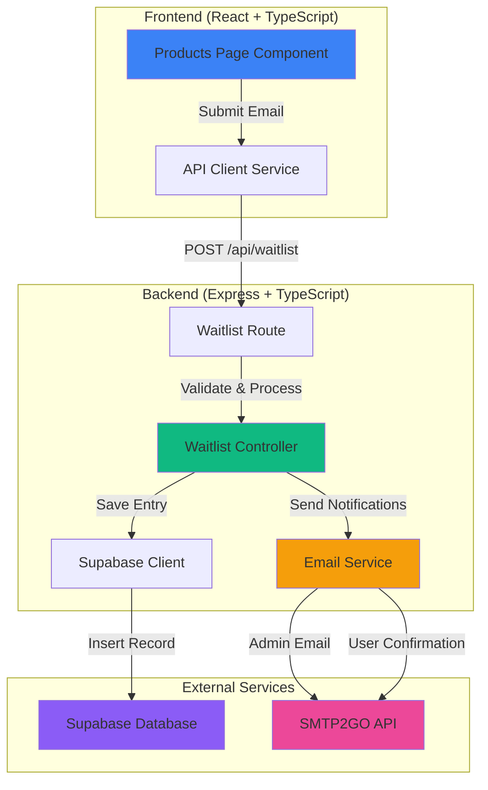
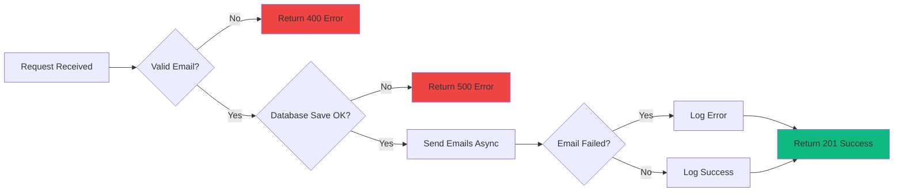

# Design Document: Product Waitlist Email Notifications

## Overview

This design document outlines the technical implementation for adding email notification functionality to the A.T.L.A.S. ENGINE waitlist form. The feature follows the established patterns from the existing contact form implementation, leveraging the current email service infrastructure (SMTP2GO), Supabase database, and Express/React architecture.

### Goals

- Enable automated email notifications when users join the A.T.L.A.S. ENGINE waitlist
- Send admin notifications to track waitlist signups
- Send user confirmations to acknowledge successful submissions
- Store waitlist entries in the database for tracking and analysis
- Maintain consistency with existing email templates and API patterns

### Non-Goals

- Building a waitlist management dashboard (future enhancement)
- Implementing duplicate email detection or prevention
- Adding unsubscribe functionality (not applicable for waitlist)
- Integrating with third-party CRM systems
- Implementing email verification or double opt-in

### Success Metrics

- Successful email delivery rate > 95%
- API response time < 2 seconds
- Zero data loss for waitlist submissions
- Consistent email template rendering across email clients

## Architecture

### System Components

The feature integrates into the existing three-tier architecture:



### Request Flow

1. **User Submission**: User enters email in waitlist form on Products page
2. **Frontend Validation**: React validates email format before submission
3. **API Request**: Frontend calls `submitWaitlist()` via API client
4. **Backend Validation**: Express validates request body using express-validator
5. **Database Storage**: Controller saves entry to Supabase `waitlist` table
6. **Email Notifications**: Controller triggers two async email sends (admin + user)
7. **Response**: Controller returns success response to frontend
8. **UI Update**: Frontend displays success message and sets submitted state

### Error Handling Flow



### Integration Points

- **Existing Email Service**: Reuses `server/src/services/emailService.ts` with SMTP2GO API
- **Existing Database Client**: Reuses `server/src/config/supabase.ts` for database operations
- **Existing API Client**: Extends `client/src/services/api.ts` with new method
- **Existing Route Pattern**: Follows same structure as contact, newsletter, and quote routes
- **Existing Middleware**: Uses rate limiting and error handling middleware

## Components and Interfaces

### Frontend Components

#### 1. Products Page Component (`client/src/pages/Products.tsx`)

**Modifications Required:**
- Import `submitWaitlist` from API client
- Add loading state for submit button
- Add error state for displaying error messages
- Update `handleSubmit` to call API instead of console.log
- Add error handling with user-friendly messages

**State Management:**
```typescript
const [email, setEmail] = useState('');
const [submitted, setSubmitted] = useState(false);
const [loading, setLoading] = useState(false);
const [error, setError] = useState<string | null>(null);
```

**Updated Submit Handler:**
```typescript
const handleSubmit = async (e: React.FormEvent) => {
  e.preventDefault();
  setLoading(true);
  setError(null);
  
  try {
    await submitWaitlist({ email });
    setSubmitted(true);
  } catch (err) {
    setError('Failed to join waitlist. Please try again or contact matthew@mrecai.com');
  } finally {
    setLoading(false);
  }
};
```

#### 2. API Client Service (`client/src/services/api.ts`)

**New Method:**
```typescript
export const submitWaitlist = async (data: { email: string }): Promise<ApiResponse<any>> => {
  const response = await api.post('/waitlist', data);
  return response.data;
};
```

**Type Definition:**
```typescript
export interface WaitlistSubmission {
  email: string;
}
```

### Backend Components

#### 1. Waitlist Controller (`server/src/controllers/waitlistController.ts`)

**New File - Responsibilities:**
- Validate request using express-validator
- Sanitize and normalize email (trim, lowercase)
- Insert record into Supabase `waitlist` table
- Trigger admin notification email (non-blocking)
- Trigger user confirmation email (non-blocking)
- Return success/error response

**Controller Function Signature:**
```typescript
export const createWaitlistEntry = async (req: Request, res: Response): Promise<void> => {
  // Implementation details in code
}
```

**Error Handling:**
- Validation errors: Return 400 with field-specific messages
- Database errors: Return 500 with generic message (log details)
- Email errors: Log but don't fail request (emails are non-critical)

#### 2. Waitlist Routes (`server/src/routes/waitlistRoutes.ts`)

**New File - Route Definition:**
```typescript
import express from 'express';
import { body } from 'express-validator';
import { createWaitlistEntry } from '../controllers/waitlistController';
import { formLimiter } from '../middleware/rateLimiter';

const router = express.Router();

router.post(
  '/',
  formLimiter, // Rate limiting: 5 requests per 15 minutes
  [
    body('email')
      .isEmail()
      .normalizeEmail()
      .withMessage('Valid email is required')
  ],
  createWaitlistEntry
);

export default router;
```

**Route Registration in `server.ts`:**
```typescript
import waitlistRoutes from './routes/waitlistRoutes';
app.use('/api/waitlist', waitlistRoutes);
```

#### 3. Email Service Extensions (`server/src/services/emailService.ts`)

**New Email Templates:**

```typescript
waitlistNotification: (data: { email: string; timestamp: string }) => ({
  subject: 'New A.T.L.A.S. ENGINE Waitlist Signup',
  html: `
    <!DOCTYPE html>
    <html>
    <head>
      <style>
        body { font-family: Arial, sans-serif; line-height: 1.6; color: #333; }
        .container { max-width: 600px; margin: 0 auto; padding: 20px; }
        .header { 
          background: linear-gradient(135deg, #1e3a8a 0%, #3b82f6 100%); 
          color: white; 
          padding: 30px; 
          text-align: center; 
          border-radius: 10px 10px 0 0; 
        }
        .content { background: #f9fafb; padding: 30px; border-radius: 0 0 10px 10px; }
        .field { margin-bottom: 20px; }
        .label { font-weight: bold; color: #1e3a8a; margin-bottom: 5px; }
        .value { 
          background: white; 
          padding: 12px; 
          border-radius: 5px; 
          border-left: 3px solid #3b82f6; 
        }
        .footer { 
          text-align: center; 
          margin-top: 30px; 
          color: #6b7280; 
          font-size: 14px; 
        }
      </style>
    </head>
    <body>
      <div class="container">
        <div class="header">
          <h1 style="margin: 0;">🚀 New Waitlist Signup</h1>
          <p style="margin: 10px 0 0 0; opacity: 0.9;">A.T.L.A.S. ENGINE</p>
        </div>
        <div class="content">
          <div class="field">
            <div class="label">Email Address:</div>
            <div class="value"><a href="mailto:${data.email}">${data.email}</a></div>
          </div>
          <div class="field">
            <div class="label">Submitted:</div>
            <div class="value">${data.timestamp}</div>
          </div>
        </div>
        <div class="footer">
          <p>This notification was sent from your A.T.L.A.S. ENGINE waitlist form</p>
          <p>MRE Consulting & Insurance | <a href="https://mrecai.com">mrecai.com</a></p>
        </div>
      </div>
    </body>
    </html>
  `
}),

waitlistConfirmation: (email: string) => ({
  subject: "You're on the A.T.L.A.S. ENGINE Waitlist!",
  html: `
    <!DOCTYPE html>
    <html>
    <head>
      <style>
        body { font-family: Arial, sans-serif; line-height: 1.6; color: #333; }
        .container { max-width: 600px; margin: 0 auto; padding: 20px; }
        .header { 
          background: linear-gradient(135deg, #1e3a8a 0%, #3b82f6 100%); 
          color: white; 
          padding: 30px; 
          text-align: center; 
          border-radius: 10px 10px 0 0; 
        }
        .content { background: #f9fafb; padding: 30px; border-radius: 0 0 10px 10px; }
        .highlight-box { 
          background: white; 
          padding: 20px; 
          border-radius: 5px; 
          margin: 20px 0; 
          border-left: 3px solid #3b82f6; 
        }
        .contact-info { 
          background: white; 
          padding: 20px; 
          border-radius: 5px; 
          margin: 20px 0; 
          border-left: 3px solid #10b981; 
        }
        .footer { 
          text-align: center; 
          margin-top: 30px; 
          color: #6b7280; 
          font-size: 14px; 
        }
      </style>
    </head>
    <body>
      <div class="container">
        <div class="header">
          <h1 style="margin: 0;">✅ You're In!</h1>
          <p style="margin: 10px 0 0 0; opacity: 0.9;">A.T.L.A.S. ENGINE Waitlist</p>
        </div>
        <div class="content">
          <h2 style="color: #1e3a8a;">Welcome to the Future of Revenue Generation</h2>
          <p>Thank you for joining the A.T.L.A.S. ENGINE waitlist! You're now on the priority list for early access to the fully autonomous revenue engine.</p>
          
          <div class="highlight-box">
            <h3 style="margin-top: 0; color: #1e3a8a;">What Happens Next?</h3>
            <p style="margin: 10px 0;">📅 <strong>Before June 1, 2026:</strong> MRECAI will reach out with your priority onboarding details</p>
            <p style="margin: 10px 0;">🎯 <strong>Early Access:</strong> Waitlist members get first access and locked-in rates</p>
            <p style="margin: 10px 0;">🚀 <strong>Launch Day:</strong> June 1, 2026 - A.T.L.A.S. ENGINE goes live</p>
          </div>

          <p>A.T.L.A.S. ENGINE will hunt, qualify, enrich, and deliver ready-to-close prospects while your team focuses on closing deals, not chasing leads.</p>

          <div class="contact-info">
            <h3 style="margin-top: 0; color: #10b981;">Questions?</h3>
            <p style="margin: 10px 0;">📧 <strong>Email:</strong> <a href="mailto:matthew@mrecai.com">matthew@mrecai.com</a></p>
            <p style="margin: 10px 0;">📞 <strong>Phone:</strong> <a href="tel:929-919-3574">929-919-3574</a></p>
            <p style="margin: 10px 0;">🌐 <strong>Website:</strong> <a href="https://mrecai.com">mrecai.com</a></p>
          </div>

          <p style="margin-top: 30px;">
            Best regards,<br>
            <strong>The MRECAI Team</strong>
          </p>
        </div>
        <div class="footer">
          <p>MRE Consulting & Insurance</p>
          <p>📍 New York, NY | 📞 929-919-3574 | 🌐 <a href="https://mrecai.com">mrecai.com</a></p>
          <p style="margin-top: 20px; font-size: 12px;">
            You received this email because you joined the A.T.L.A.S. ENGINE waitlist at mrecai.com<br>
            Your email: ${email}
          </p>
        </div>
      </div>
    </body>
    </html>
  `
})
```

## Data Models

### Database Schema

#### Waitlist Table

**Table Name:** `waitlist`

**Columns:**

| Column Name | Type | Constraints | Description |
|------------|------|-------------|-------------|
| id | UUID | PRIMARY KEY, DEFAULT uuid_generate_v4() | Unique identifier for each entry |
| email | VARCHAR(255) | NOT NULL | User's email address (trimmed, lowercase) |
| created_at | TIMESTAMP WITH TIME ZONE | NOT NULL, DEFAULT NOW() | Timestamp of submission |

**Indexes:**
- Primary key index on `id` (automatic)
- Index on `email` for duplicate checking (future enhancement)
- Index on `created_at` for chronological queries

**SQL Schema:**
```sql
CREATE TABLE IF NOT EXISTS waitlist (
  id UUID PRIMARY KEY DEFAULT uuid_generate_v4(),
  email VARCHAR(255) NOT NULL,
  created_at TIMESTAMP WITH TIME ZONE NOT NULL DEFAULT NOW()
);

CREATE INDEX idx_waitlist_email ON waitlist(email);
CREATE INDEX idx_waitlist_created_at ON waitlist(created_at DESC);
```

**Supabase Configuration:**
- Enable Row Level Security (RLS)
- Service role bypasses RLS for server operations
- No public access policies (server-only table)

### API Request/Response Models

#### POST /api/waitlist Request

```typescript
interface WaitlistRequest {
  email: string; // Required, must be valid email format
}
```

**Example:**
```json
{
  "email": "user@example.com"
}
```

#### POST /api/waitlist Response (Success)

```typescript
interface WaitlistSuccessResponse {
  success: true;
  message: string;
  data: {
    id: string;
    email: string;
    created_at: string;
  };
}
```

**Example:**
```json
{
  "success": true,
  "message": "Successfully joined the waitlist! Check your email for confirmation.",
  "data": {
    "id": "550e8400-e29b-41d4-a716-446655440000",
    "email": "user@example.com",
    "created_at": "2024-01-15T10:30:00.000Z"
  }
}
```

#### POST /api/waitlist Response (Validation Error)

```typescript
interface WaitlistValidationError {
  success: false;
  message: string;
  errors: Array<{
    field: string;
    message: string;
  }>;
}
```

**Example:**
```json
{
  "success": false,
  "message": "Validation failed",
  "errors": [
    {
      "field": "email",
      "message": "Valid email is required"
    }
  ]
}
```

#### POST /api/waitlist Response (Server Error)

```typescript
interface WaitlistServerError {
  success: false;
  message: string;
}
```

**Example:**
```json
{
  "success": false,
  "message": "Failed to join waitlist. Please try again or contact us at matthew@mrecai.com"
}
```

### Email Data Models

#### Admin Notification Data

```typescript
interface WaitlistNotificationData {
  email: string;
  timestamp: string; // ISO 8601 format
}
```

#### User Confirmation Data

```typescript
interface WaitlistConfirmationData {
  email: string;
}
```


## Correctness Properties

*A property is a characteristic or behavior that should hold true across all valid executions of a system—essentially, a formal statement about what the system should do. Properties serve as the bridge between human-readable specifications and machine-verifiable correctness guarantees.*

### Property Reflection

After analyzing all acceptance criteria, several properties were identified as redundant or combinable:

**Consolidations Made:**
- Properties 1.2 and 1.3 (validation behavior) → Combined into Property 1 (validation rejects invalid inputs)
- Properties 6.2, 6.3, 6.4 (database record fields) → Combined into Property 4 (database records contain required fields)
- Properties 6.6 and 6.7 (email normalization) → Combined into Property 5 (email normalization)
- Properties 2.4 and 2.5 (notification email content) → Combined into Property 6 (notification contains required data)
- Properties 9.4, 9.5, 9.6 (frontend error messages) → Combined into Property 10 (user-friendly error messages)

**Properties Excluded:**
- Visual/design properties (2.6, 3.7, 7.4, 7.7) - not programmatically testable
- Code structure properties (5.5, 5.6, 8.6, 10.4) - enforced by linting/TypeScript/code review
- Properties fully subsumed by others

### Property 1: Invalid Email Validation

*For any* request to the waitlist endpoint with a missing or invalid email field, the system should return a 400 status code with validation error details indicating the email field is invalid.

**Validates: Requirements 1.2, 1.3**

### Property 2: Valid Email Database Storage

*For any* valid email submitted to the waitlist endpoint, the system should successfully save an entry to the database and return a 201 status code.

**Validates: Requirements 1.4, 1.6, 6.1**

### Property 3: Request Body Email Transmission

*For any* email value entered in the waitlist form, when submitted, the frontend should include that exact email value in the API request body.

**Validates: Requirements 4.2**

### Property 4: Database Record Completeness

*For any* waitlist entry saved to the database, the record should contain a unique ID, the user's email address, and a creation timestamp.

**Validates: Requirements 6.2, 6.3, 6.4**

### Property 5: Email Normalization

*For any* email submitted to the waitlist, the system should trim whitespace and convert to lowercase before saving to the database.

**Validates: Requirements 6.6, 6.7**

### Property 6: Admin Notification Content

*For any* valid waitlist submission, the admin notification email should contain both the user's email address and the submission timestamp.

**Validates: Requirements 2.4, 2.5**

### Property 7: User Confirmation Delivery

*For any* valid waitlist submission, the system should send a confirmation email to the submitted email address.

**Validates: Requirements 3.1**

### Property 8: Email Failure Non-Blocking

*For any* waitlist submission where email sending fails, the system should still return a successful response (201) to the user and log the email error.

**Validates: Requirements 2.8, 3.9, 9.3**

### Property 9: Network Error Resilience

*For any* network error or API failure during waitlist submission, the frontend should handle the error gracefully without crashing and display an error message.

**Validates: Requirements 4.6, 4.8**

### Property 10: User-Friendly Error Messages

*For any* error scenario in the frontend, the displayed error message should be user-friendly (no technical details exposed) and include actionable guidance such as retry instructions or contact information.

**Validates: Requirements 9.4, 9.5, 9.6**

### Property 11: Validation Error Descriptiveness

*For any* validation failure on the backend, the error response should include a descriptive message indicating which specific field is invalid.

**Validates: Requirements 9.1**

## Error Handling

### Error Categories

#### 1. Validation Errors (400 Bad Request)

**Scenarios:**
- Missing email field
- Invalid email format
- Empty email string

**Handling:**
- Express-validator middleware catches validation errors
- Controller checks `validationResult(req)`
- Returns 400 with field-specific error messages
- Frontend displays validation error to user

**Example Response:**
```json
{
  "success": false,
  "message": "Validation failed",
  "errors": [
    {
      "field": "email",
      "message": "Valid email is required"
    }
  ]
}
```

#### 2. Database Errors (500 Internal Server Error)

**Scenarios:**
- Supabase connection failure
- Database insert failure
- Timeout errors

**Handling:**
- Controller catches database errors
- Logs detailed error for debugging
- Returns generic error message to user (security)
- Does not expose internal database details

**Example Response:**
```json
{
  "success": false,
  "message": "Failed to join waitlist. Please try again or contact us at matthew@mrecai.com"
}
```

**Logging:**
```typescript
console.error('Database error:', error);
// Logs full error details for debugging
```

#### 3. Email Sending Errors (Non-Blocking)

**Scenarios:**
- SMTP2GO API failure
- Network timeout
- Invalid email configuration

**Handling:**
- Email sending wrapped in try-catch
- Errors logged but don't fail the request
- User still receives success response
- Admin can monitor logs for email issues

**Rationale:** Email delivery is important but not critical to the core functionality of recording the waitlist signup. Users should not be blocked from joining the waitlist due to temporary email issues.

**Logging:**
```typescript
sendEmail(options).catch(err => {
  console.error('Email notification failed:', err);
  // Request continues successfully
});
```

#### 4. Frontend Network Errors

**Scenarios:**
- API endpoint unreachable
- Request timeout
- CORS errors
- Network disconnection

**Handling:**
- Axios catches network errors
- Frontend displays user-friendly error message
- Loading state cleared
- User can retry submission

**Example Error Display:**
```typescript
catch (err) {
  setError('Failed to join waitlist. Please try again or contact matthew@mrecai.com');
  setLoading(false);
}
```

### Error Recovery Strategies

#### Retry Logic
- **Frontend:** User can manually retry by resubmitting form
- **Backend:** No automatic retries (idempotency not guaranteed)
- **Email Service:** SMTP2GO handles retries internally

#### Graceful Degradation
- Database failure → User sees error, can contact directly
- Email failure → User still joins waitlist, may not receive confirmation
- Frontend error → Form remains functional, user can retry

#### Monitoring and Alerting
- Log all errors with context (timestamp, email, error type)
- Monitor email delivery rates via SMTP2GO dashboard
- Track 500 errors for database issues
- Alert on sustained high error rates

### Security Considerations

#### Input Validation
- Email format validation using express-validator
- Normalization (trim, lowercase) prevents duplicates
- No SQL injection risk (using Supabase parameterized queries)

#### Error Message Safety
- Never expose database errors to users
- Never expose internal system details
- Generic messages for server errors
- Specific messages only for validation errors

#### Rate Limiting
- Apply `formLimiter` middleware (5 requests per 15 minutes)
- Prevents spam and abuse
- Same rate limit as contact form

## Testing Strategy

### Dual Testing Approach

This feature requires both **unit tests** and **property-based tests** for comprehensive coverage:

- **Unit Tests**: Verify specific examples, edge cases, and integration points
- **Property Tests**: Verify universal properties across randomized inputs

### Unit Testing

**Framework:** Jest (existing test framework)

**Test Files:**
- `server/src/controllers/waitlistController.test.ts`
- `server/src/routes/waitlistRoutes.test.ts`
- `client/src/pages/Products.test.tsx`
- `client/src/services/api.test.ts`

**Unit Test Focus Areas:**

1. **Specific Examples:**
   - Endpoint exists at `/api/waitlist` (Req 1.1)
   - Admin email defaults to matthew@mrecai.com when env var not set (Req 10.2)
   - Notification email subject is "New A.T.L.A.S. ENGINE Waitlist Signup" (Req 2.3)
   - Confirmation email subject is "You're on the A.T.L.A.S. ENGINE Waitlist!" (Req 3.2)
   - Confirmation email contains "before June 1, 2026" text (Req 3.5)
   - Error message includes matthew@mrecai.com contact info (Req 4.7)

2. **Edge Cases:**
   - Empty email string
   - Email with only whitespace
   - Email with mixed case
   - Database connection failure
   - Email service failure

3. **Integration Points:**
   - Route registration in server.ts (Req 8.4, 8.5)
   - API client method exists and has correct signature (Req 5.1, 5.2, 5.3, 5.4)
   - Email templates exist in emailTemplates object (Req 7.1)
   - Validation middleware applied to route (Req 8.3)

4. **UI State Management:**
   - Loading state shown during API call (Req 4.3)
   - Success message displayed after submission (Req 4.4)
   - Submitted state set to true after success (Req 4.5)
   - Form calls API client method (Req 4.1)

**Example Unit Tests:**

```typescript
describe('Waitlist Controller', () => {
  it('should return 201 for valid email', async () => {
    const response = await request(app)
      .post('/api/waitlist')
      .send({ email: 'test@example.com' });
    expect(response.status).toBe(201);
  });

  it('should return 400 for missing email', async () => {
    const response = await request(app)
      .post('/api/waitlist')
      .send({});
    expect(response.status).toBe(400);
  });

  it('should use default admin email when env var not set', () => {
    delete process.env.ADMIN_EMAIL;
    const adminEmail = process.env.ADMIN_EMAIL || 'matthew@mrecai.com';
    expect(adminEmail).toBe('matthew@mrecai.com');
  });
});
```

### Property-Based Testing

**Framework:** fast-check (JavaScript/TypeScript property-based testing library)

**Configuration:**
- Minimum 100 iterations per property test
- Each test tagged with feature name and property number

**Property Test Files:**
- `server/src/controllers/waitlistController.property.test.ts`
- `client/src/pages/Products.property.test.ts`

**Property Test Implementation:**

Each correctness property from the design document should be implemented as a property-based test:

```typescript
import fc from 'fast-check';

describe('Property Tests: Waitlist Feature', () => {
  /**
   * Feature: product-waitlist-email-notifications, Property 1
   * Invalid Email Validation
   */
  it('should reject all invalid emails with 400 status', () => {
    fc.assert(
      fc.asyncProperty(
        fc.oneof(
          fc.constant(''),
          fc.constant('not-an-email'),
          fc.constant('missing@domain'),
          fc.string().filter(s => !s.includes('@'))
        ),
        async (invalidEmail) => {
          const response = await request(app)
            .post('/api/waitlist')
            .send({ email: invalidEmail });
          expect(response.status).toBe(400);
          expect(response.body.success).toBe(false);
        }
      ),
      { numRuns: 100 }
    );
  });

  /**
   * Feature: product-waitlist-email-notifications, Property 2
   * Valid Email Database Storage
   */
  it('should save all valid emails to database and return 201', () => {
    fc.assert(
      fc.asyncProperty(
        fc.emailAddress(),
        async (validEmail) => {
          const response = await request(app)
            .post('/api/waitlist')
            .send({ email: validEmail });
          
          expect(response.status).toBe(201);
          expect(response.body.success).toBe(true);
          
          // Verify database entry
          const { data } = await supabase
            .from('waitlist')
            .select('*')
            .eq('email', validEmail.toLowerCase().trim())
            .single();
          
          expect(data).toBeTruthy();
        }
      ),
      { numRuns: 100 }
    );
  });

  /**
   * Feature: product-waitlist-email-notifications, Property 5
   * Email Normalization
   */
  it('should normalize all emails (trim and lowercase) before saving', () => {
    fc.assert(
      fc.asyncProperty(
        fc.emailAddress(),
        fc.constantFrom(' ', '  ', '\t', '\n'),
        fc.boolean(),
        async (email, whitespace, shouldUppercase) => {
          const testEmail = shouldUppercase 
            ? whitespace + email.toUpperCase() + whitespace
            : whitespace + email + whitespace;
          
          const response = await request(app)
            .post('/api/waitlist')
            .send({ email: testEmail });
          
          expect(response.status).toBe(201);
          expect(response.body.data.email).toBe(email.toLowerCase().trim());
        }
      ),
      { numRuns: 100 }
    );
  });

  /**
   * Feature: product-waitlist-email-notifications, Property 4
   * Database Record Completeness
   */
  it('should include id, email, and timestamp in all database records', () => {
    fc.assert(
      fc.asyncProperty(
        fc.emailAddress(),
        async (email) => {
          const response = await request(app)
            .post('/api/waitlist')
            .send({ email });
          
          const record = response.body.data;
          expect(record.id).toBeDefined();
          expect(typeof record.id).toBe('string');
          expect(record.email).toBeDefined();
          expect(record.created_at).toBeDefined();
          expect(new Date(record.created_at).getTime()).toBeGreaterThan(0);
        }
      ),
      { numRuns: 100 }
    );
  });
});
```

**Property Test Tags:**

Each property test must include a comment tag referencing the design document:

```typescript
/**
 * Feature: product-waitlist-email-notifications, Property {number}
 * {Property Title}
 */
```

### Test Coverage Goals

- **Unit Test Coverage:** > 80% line coverage
- **Property Test Coverage:** All 11 correctness properties implemented
- **Integration Test Coverage:** All API endpoints and routes
- **E2E Test Coverage:** Complete user flow (form submission → success message)

### Testing Dependencies

**Required Packages:**
```json
{
  "devDependencies": {
    "jest": "^29.0.0",
    "@types/jest": "^29.0.0",
    "fast-check": "^3.0.0",
    "supertest": "^6.0.0",
    "@testing-library/react": "^14.0.0",
    "@testing-library/user-event": "^14.0.0"
  }
}
```

### Test Execution

**Run All Tests:**
```bash
npm test
```

**Run Unit Tests Only:**
```bash
npm test -- --testPathPattern="\.test\.ts$"
```

**Run Property Tests Only:**
```bash
npm test -- --testPathPattern="\.property\.test\.ts$"
```

**Run with Coverage:**
```bash
npm test -- --coverage
```


## Security Considerations

### Input Validation and Sanitization

#### Email Validation
- **Format Validation:** Use express-validator's `isEmail()` to validate email format
- **Normalization:** Apply `normalizeEmail()` to standardize email format
- **Sanitization:** Trim whitespace and convert to lowercase
- **Length Limits:** Email field limited to 255 characters (database constraint)

**Implementation:**
```typescript
body('email')
  .isEmail()
  .normalizeEmail()
  .withMessage('Valid email is required')
```

#### SQL Injection Prevention
- **Parameterized Queries:** Supabase client uses parameterized queries by default
- **No Raw SQL:** Never construct SQL strings with user input
- **ORM Protection:** Supabase SDK handles escaping automatically

### Authentication and Authorization

#### Public Endpoint
- Waitlist endpoint is intentionally public (no authentication required)
- Users should be able to join waitlist without creating an account
- Rate limiting provides abuse protection

#### Database Access
- **Service Role Key:** Backend uses Supabase service role key
- **RLS Policies:** Row Level Security enabled on waitlist table
- **No Public Access:** Table not accessible from client-side Supabase client
- **Server-Only Operations:** All database operations through backend API

### Rate Limiting

#### Form Submission Rate Limit
- **Middleware:** `formLimiter` from existing rate limiter middleware
- **Limit:** 5 requests per 15 minutes per IP address
- **Scope:** Applied to POST /api/waitlist endpoint
- **Response:** 429 Too Many Requests when limit exceeded

**Configuration:**
```typescript
import { formLimiter } from '../middleware/rateLimiter';

router.post('/', formLimiter, [...], createWaitlistEntry);
```

#### Email Sending Rate Limit
- **SMTP2GO Limits:** Respects SMTP2GO account sending limits
- **Non-Blocking:** Email failures don't block user submissions
- **Monitoring:** Track email delivery rates via SMTP2GO dashboard

### Data Privacy

#### Personal Information
- **Minimal Collection:** Only email address collected (no names, phones, etc.)
- **Purpose:** Email used solely for waitlist notifications
- **Retention:** No automatic deletion (business requirement for tracking)
- **Access:** Admin-only access via database

#### Email Content
- **No Sensitive Data:** Emails contain only email address and timestamp
- **Secure Transmission:** SMTP2GO uses TLS encryption
- **No Tracking Pixels:** Email templates don't include tracking images

#### Compliance Considerations
- **GDPR:** Users in EU may request data deletion (manual process)
- **CAN-SPAM:** Confirmation emails include company contact information
- **CCPA:** California users may request data access (manual process)

### Error Message Security

#### Information Disclosure Prevention
- **Generic Server Errors:** Don't expose database errors to users
- **No Stack Traces:** Never send stack traces in API responses
- **Validation Details:** Only expose field-level validation errors
- **Logging:** Detailed errors logged server-side only

**Safe Error Messages:**
```typescript
// ✅ Good: Generic message
"Failed to join waitlist. Please try again or contact us at matthew@mrecai.com"

// ❌ Bad: Exposes internal details
"Database connection failed: Connection timeout to supabase.co:5432"
```

### Environment Variable Security

#### Sensitive Configuration
- **SMTP2GO Credentials:** Stored in environment variables
- **Supabase Keys:** Service role key in environment variables
- **Admin Email:** Configurable via environment variable
- **Never Committed:** .env files in .gitignore

#### Production Deployment
- **Railway Variables:** Set via Railway dashboard (not in code)
- **No Defaults for Secrets:** Fail fast if credentials missing
- **Rotation:** Support credential rotation without code changes

### CORS Configuration

#### Allowed Origins
- **Whitelist:** Only configured CLIENT_URL origins allowed
- **No Wildcards:** Never use `*` for production
- **Credentials:** CORS credentials enabled for authenticated requests

**Configuration:**
```typescript
app.use(cors({
  origin: (origin, callback) => {
    if (!origin || allowedOrigins.includes(origin)) {
      callback(null, true);
    } else {
      callback(new Error('Not allowed by CORS'));
    }
  },
  credentials: true
}));
```

### Email Security

#### SMTP2GO Security
- **API Authentication:** Requires API key for all requests
- **TLS Encryption:** All email transmission encrypted
- **SPF/DKIM:** Configured for domain authentication
- **Bounce Handling:** SMTP2GO handles bounces and complaints

#### Email Content Security
- **No User-Generated Content:** Email templates are static
- **HTML Escaping:** User email addresses escaped in HTML
- **No External Resources:** Email templates don't load external images/scripts
- **Safe Links:** All links use HTTPS

### Monitoring and Logging

#### Security Logging
- **Failed Validations:** Log validation failures for abuse detection
- **Rate Limit Hits:** Log rate limit violations
- **Database Errors:** Log all database errors with context
- **Email Failures:** Log email sending failures

#### Log Security
- **No Passwords:** Never log credentials or API keys
- **Sanitized Emails:** Consider hashing emails in logs (future enhancement)
- **Structured Logging:** Use consistent log format for parsing
- **Retention:** Follow log retention policies

**Example Logging:**
```typescript
console.log('Waitlist submission:', {
  email: email.substring(0, 3) + '***', // Partial masking
  timestamp: new Date().toISOString(),
  ip: req.ip
});
```

## Implementation Checklist

### Backend Implementation

- [ ] Create `server/src/controllers/waitlistController.ts`
  - [ ] Implement `createWaitlistEntry` function
  - [ ] Add validation error handling
  - [ ] Add database error handling
  - [ ] Add email notification triggers
  - [ ] Add response formatting

- [ ] Create `server/src/routes/waitlistRoutes.ts`
  - [ ] Define POST route with validation
  - [ ] Apply rate limiting middleware
  - [ ] Export router

- [ ] Update `server/src/services/emailService.ts`
  - [ ] Add `waitlistNotification` template
  - [ ] Add `waitlistConfirmation` template
  - [ ] Ensure templates match existing style

- [ ] Update `server/src/server.ts`
  - [ ] Import waitlist routes
  - [ ] Register routes at `/api/waitlist`

- [ ] Create Supabase migration
  - [ ] Create `waitlist` table schema
  - [ ] Add indexes
  - [ ] Configure RLS policies

### Frontend Implementation

- [ ] Update `client/src/services/api.ts`
  - [ ] Add `submitWaitlist` function
  - [ ] Add TypeScript types

- [ ] Update `client/src/pages/Products.tsx`
  - [ ] Add loading state
  - [ ] Add error state
  - [ ] Update `handleSubmit` to call API
  - [ ] Add error message display
  - [ ] Update button to show loading state

### Testing Implementation

- [ ] Create `server/src/controllers/waitlistController.test.ts`
  - [ ] Unit tests for validation
  - [ ] Unit tests for database operations
  - [ ] Unit tests for error handling

- [ ] Create `server/src/controllers/waitlistController.property.test.ts`
  - [ ] Property test for invalid email validation
  - [ ] Property test for valid email storage
  - [ ] Property test for email normalization
  - [ ] Property test for database record completeness
  - [ ] Property test for error handling

- [ ] Create `client/src/pages/Products.test.tsx`
  - [ ] Unit tests for form submission
  - [ ] Unit tests for loading states
  - [ ] Unit tests for error display

### Configuration and Deployment

- [ ] Verify environment variables
  - [ ] ADMIN_EMAIL (or use default)
  - [ ] SMTP2GO_API_KEY
  - [ ] SUPABASE_URL
  - [ ] SUPABASE_SERVICE_KEY

- [ ] Run database migration
  - [ ] Execute SQL schema in Supabase
  - [ ] Verify table created
  - [ ] Test database connection

- [ ] Test email delivery
  - [ ] Send test admin notification
  - [ ] Send test user confirmation
  - [ ] Verify email formatting
  - [ ] Check spam folder

### Verification

- [ ] Manual testing
  - [ ] Submit valid email
  - [ ] Verify success message
  - [ ] Check database entry
  - [ ] Verify admin email received
  - [ ] Verify user confirmation received

- [ ] Error testing
  - [ ] Submit invalid email
  - [ ] Submit empty form
  - [ ] Test with network disconnected
  - [ ] Verify error messages

- [ ] Integration testing
  - [ ] Test complete user flow
  - [ ] Verify rate limiting
  - [ ] Test email failure handling
  - [ ] Test database failure handling

## Deployment Strategy

### Pre-Deployment

1. **Code Review:** Review all changes for security and correctness
2. **Test Execution:** Run all unit and property tests
3. **Database Migration:** Execute Supabase migration in production
4. **Environment Variables:** Verify all required env vars set in Railway
5. **Email Testing:** Send test emails to verify SMTP2GO configuration

### Deployment Steps

1. **Merge to Main:** Merge feature branch to main branch
2. **Automatic Deployment:** Railway auto-deploys from main branch
3. **Health Check:** Verify `/health` endpoint responds
4. **Smoke Test:** Submit test waitlist entry
5. **Monitor Logs:** Watch Railway logs for errors

### Post-Deployment

1. **Verify Functionality:** Test waitlist form on production site
2. **Check Email Delivery:** Confirm emails being sent
3. **Monitor Error Rates:** Watch for 4xx/5xx errors
4. **Database Verification:** Confirm entries being saved
5. **User Feedback:** Monitor for user-reported issues

### Rollback Plan

If critical issues discovered:

1. **Immediate:** Revert to previous Railway deployment
2. **Database:** Waitlist table can remain (no breaking changes)
3. **Frontend:** Previous version still functional (no API dependency)
4. **Communication:** Notify team of rollback and issues

## Future Enhancements

### Phase 2 Enhancements (Not in Current Scope)

1. **Duplicate Detection**
   - Prevent same email from joining multiple times
   - Show "already on waitlist" message
   - Add unique constraint on email field

2. **Waitlist Management Dashboard**
   - Admin interface to view all waitlist entries
   - Export to CSV functionality
   - Search and filter capabilities
   - Bulk email functionality

3. **Email Verification**
   - Send verification link before confirming signup
   - Prevent fake/spam email addresses
   - Double opt-in process

4. **Analytics Integration**
   - Track conversion rates
   - Monitor signup sources
   - A/B test different messaging

5. **CRM Integration**
   - Automatically add to HubSpot/Salesforce
   - Sync with email marketing platform
   - Trigger automated follow-up sequences

6. **Unsubscribe Functionality**
   - Allow users to remove themselves from waitlist
   - Compliance with email regulations
   - Preference management

7. **Priority Tiers**
   - Early bird vs. regular waitlist
   - VIP access for referrals
   - Tiered notification system

## Appendix

### Related Documentation

- [Requirements Document](./.kiro/specs/product-waitlist-email-notifications/requirements.md)
- [Contact Form Implementation](../../server/src/controllers/contactController.ts)
- [Email Service Documentation](../../server/src/services/emailService.ts)
- [Supabase Configuration](../../server/src/config/supabase.ts)

### External Resources

- [SMTP2GO API Documentation](https://apidocs.smtp2go.com/documentation/)
- [Supabase JavaScript Client](https://supabase.com/docs/reference/javascript/introduction)
- [Express Validator Documentation](https://express-validator.github.io/docs/)
- [fast-check Documentation](https://fast-check.dev/)

### Glossary Reference

See [Requirements Document - Glossary](./.kiro/specs/product-waitlist-email-notifications/requirements.md#glossary) for term definitions.

---

**Document Version:** 1.0  
**Last Updated:** 2024-01-15  
**Author:** Kiro AI  
**Status:** Ready for Implementation
